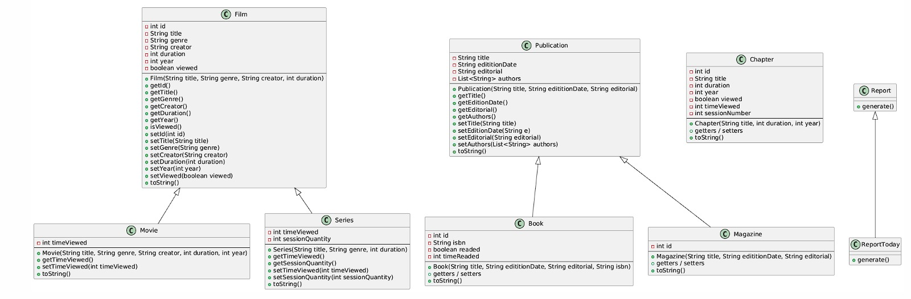

# SENA Viewer

SENA Viewer es una aplicación de consola diseñada para simular una plataforma de streaming de contenido multimedia. El proyecto tiene como objetivo proporcionar a los usuarios una experiencia interactiva para explorar y "ver" diferentes tipos de contenido digital, incluyendo películas, series, libros y revistas.

## Integrantes y Roles

| Nombre              | Rol                                |
| ------------------- | ---------------------------------- |
| **Santiago Pinzon** | Líder y coordinador del proyecto   |
| **Cristian Giraldo**| Manejo de repositorio y merges     |
| **Ivan Acosta**     | Revisor de código y arreglo de errores |

## Estructura del Proyecto

El proyecto está organizado en la siguiente estructura de carpetas y clases:

```
sena-viewer-the-group/
├── src/
│   └── edu/
│       └── miSena/
│           └── senaViewer/
│               ├── app/
│               │   └── App.java             # Clase principal que ejecuta la aplicación
│               └── model/
│                   ├── Publication.java     # Clase padre para publicaciones (libros, revistas)
│                   ├── Book.java            # Hereda de Publication
│                   ├── Magazine.java        # Hereda de Publication
│                   ├── Film.java            # Clase padre para material filmográfico (películas, series)
│                   ├── Movie.java           # Hereda de Film
│                   ├── Series.java          # Hereda de Film
│                   ├── Chapter.java         # Representa un capítulo de una serie
│                   └── Report.java          # (No implementado en el código actual)
├── bin/                                     # Directorio para los archivos .class compilados
├── .gitignore
└── README.md
```

## Diagrama de Clases

A continuación se muestra el diagrama de herencia principal del modelo de clases:



## Instrucciones para Compilar y Ejecutar

### Requisitos
- JDK 17 o superior.
- Git.

### Compilación
1. Clona el repositorio:
   ```bash
   git clone <url-del-repositorio>
   ```
2. Navega al directorio del proyecto:
   ```bash
   cd sena-viewer-the-group
   ```
3. Crea el directorio `bin` si no existe para almacenar los archivos compilados:
   ```bash
   mkdir bin
   ```
4. Compila los archivos fuente de Java:
   ```bash
   javac -d bin src/edu/miSena/senaViewer/app/App.java src/edu/miSena/senaViewer/model/*.java
   ```

### Ejecución
1. Una vez compilado el proyecto, ejecuta la clase principal `App` desde el directorio raíz:
   ```bash
   java -cp bin edu.miSena.senaViewer.app.App
   ```
2. La aplicación se iniciará en la consola y mostrará el menú principal.

## Demo del Proyecto (Sprint Review)

*(Sección para agregar un GIF o video demostrativo de la aplicación en funcionamiento)*

```
:: BIENVENIDOS A SENA VIEWER ::
Selecciona una opción
1. Movies
2. Series
3. Books
4. Magazines
5. Report
6. Report Today
0. Exit

Opción: 1

:: MOVIES ::
1. Movie 1
2. Movie 2
3. Movie 3
0. Regresar

...
```